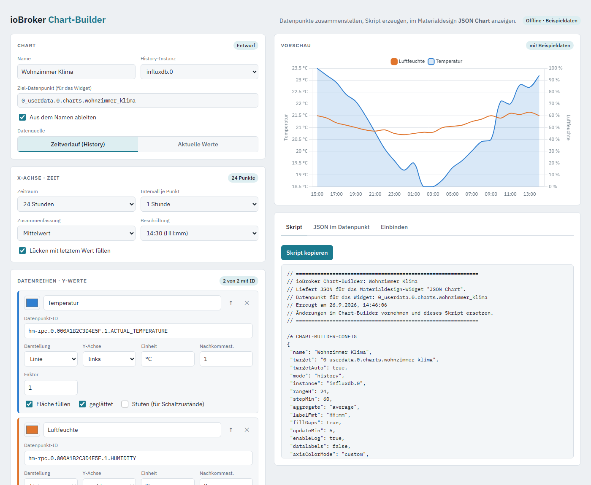

# ioBroker Chart-Builder

Eine Weboberfläche, mit der du Charts für das **Materialdesign-Widget „JSON Chart“** in vis zusammenklickst – ohne flot, ohne iFrame-URLs, ohne IP-Adressen im Widget.

Du wählst Datenpunkte aus, stellst X- und Y-Achse ein, siehst sofort eine Vorschau mit echten Daten und legst mit einem Klick ein JavaScript in ioBroker an. Das Skript schreibt das fertige Chart-JSON in einen Datenpunkt, den du im Widget einträgst. Änderungen am Chart machst du später wieder im Chart-Builder – in vis musst du nichts anfassen.



## Funktionen

- **Datenpunkt-Suche** im Objektbaum mit Suchwörtern (z. B. `wohn temp`), Name und Einheit werden übernommen
- **Status je Datenpunkt**: gefunden? geloggt in der gewählten History-Instanz?
- **Logging automatisch aktivieren** für history, influxdb und sql
- **Zeitverlauf** mit Zeitraum, Intervall, Zusammenfassung (Mittelwert, Min, Max, Summe, Verbrauch aus Zählerstand) und Beschriftungsformat
- **Aktuelle Werte** als Balken, aktualisiert bei jeder Wertänderung
- Pro Datenreihe: Linie oder Balken, linke/rechte/eigene Y-Achse, Einheit, Farbe, Nachkommastellen, Faktor, Füllung, Glättung, Stufen, Stapeln
- **Live-Vorschau** mit echten Daten aus deiner History
- **„In ioBroker anlegen“** legt das Skript unter `script.js.ChartBuilder.<name>` an bzw. aktualisiert es
- **„Aus ioBroker laden“** liest bestehende Charts wieder ein – die Konfiguration steckt im Skript selbst

## Voraussetzungen

- ioBroker mit **web**-Adapter (Socket-Verbindung aktiv, wie für vis ohnehin nötig)
- **javascript**-Adapter
- eine History-Instanz: **history**, **influxdb** oder **sql**
- vis mit dem Adapter **vis-materialdesign** (Widget „JSON Chart“)

## Installation

1. Die Datei [`index.html`](index.html) herunterladen.
2. Im ioBroker-Admin den Reiter **Dateien** öffnen (ggf. Expertenmodus einschalten).
3. In **0_userdata.0** einen Ordner `chartbuilder` anlegen und `index.html` hochladen.
4. Im Browser öffnen:

   ```
   http://<iobroker-ip>:8082/0_userdata.0/chartbuilder/index.html
   ```

   Oben rechts sollte **„Verbunden mit ioBroker“** stehen.

Falls die Adresse nicht funktioniert, die Datei alternativ in `vis.0/chartbuilder/` hochladen und `http://<iobroker-ip>:8082/vis.0/chartbuilder/index.html` aufrufen.

Die Datei lässt sich auch einfach per Doppelklick öffnen. Dann läuft sie ohne Verbindung mit Beispieldaten, und das Skript wird über **„Skript kopieren“** von Hand im Skript-Editor eingefügt.

## Benutzung

1. Chart benennen und History-Instanz wählen.
2. Datenreihen hinzufügen: ID eintippen oder suchen, Darstellung und Achse wählen.
3. X-Achse (Zeitraum, Intervall, Beschriftung) und Y-Achsen (Titel, Einheit, Min/Max) einstellen.
4. **„In ioBroker anlegen“** klicken.
5. In vis das Widget **Materialdesign → JSON Chart** platzieren und bei **Object ID** den Ziel-Datenpunkt eintragen (z. B. `0_userdata.0.charts.wohnzimmer_klima`).

Legende, Schriftarten und die Beschriftung der X-Achse stellst du in den Widget-Eigenschaften in vis ein.

## Hinweise

- Wird das Logging erst durch das Skript aktiviert, sammelt die History-Instanz ab diesem Zeitpunkt – das Chart füllt sich nach und nach.
- Die Seite lädt die Chart-Bibliothek [Chart.js](https://www.chartjs.org/) und die Schrift IBM Plex von einem CDN. Der Browser braucht dafür Internetzugang.
- Der Chart-Builder schreibt nur in `script.js.ChartBuilder.*` und in den gewählten Ziel-Datenpunkt.

## English summary

A single-file web UI for ioBroker that builds charts for the vis-materialdesign "JSON Chart" widget. Pick datapoints, configure axes, preview with real history data and create a JavaScript with one click. The script writes the chart JSON into a datapoint that the widget displays. Upload `index.html` via the Admin "Files" tab and open it through the web adapter.

## Lizenz

[MIT](LICENSE)
